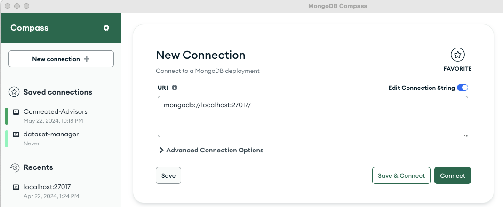

# Connected Advisor | SJTU-CS3321-Group-Project


## 设计灵感

找到合适的导师是每位科研人员迈向成功的重要一步。无论是即将毕业的本科生寻找研究导师，还是研究生和博士生选择科研方向和导师，深入了解潜在导师的信息都至关重要。虽然导师的学术能力和研究方向可以通过 Google Scholar、个人主页或学校官网等公开渠道获取，但关于导师的个人品质、师生关系、资源和人脉等信息则难以直接获取。

在这种情况下，通过导师的现有学生、合作伙伴或其他联系人来获取这些信息显得尤为重要。此外，如果能通过共同认识的人引荐，与导师的沟通会更加自然，合作也会更顺畅。为此，我们开发了“Connected Advisor”系统。该系统的灵感来源于著名的“六度分离理论”，该理论指出，通过最多六个人的关系网，我们就能够认识任何一个陌生人。

“Connected Advisor”让用户可以轻松查询和筛选导师信息，并查看导师与其他导师的关系图谱。系统支持在图谱上进行便捷的跳转操作，帮助用户构建和拓展自己的学术和职业网络。这不仅提高了寻找导师的效率，还增加了选择的透明度和可能性。

我们特意选择使用“Advisor”一词而不是“Scholar”，是因为“Advisor”可以直译为“建议者”。**我们希望强调的是，每一个节点的学者对用户的信息价值——这些节点不仅是科研技术上的指导者，更是科研经验和教训的提供者，能够在选导师、科研方向等方面给予宝贵的建议。**

## 代码结构

这里我们展示出主要的代码结构：

```
- code
    - README.md: 文档
    - public/: 网站中用到的静态资源，如各种图像等
    - src/: 主要代码
        - components/: 各种组件
            - mainPage/：主界面中使用的组件
                - advisorCardComponents/ : AdvisorCard中使用的组件
                - dataRender/ : 实现 graph render和list render
                - uploadInfo/ : 处理上传Advisor功能
                - mainContent.tsx : 主界面顶层文件
                - ...
            - wrapped_api/ : 按照实体类型对各种API进行包装
            - topMenu.tsx : 顶部菜单栏
            - const.tsx : 存储常量
            - interface.tsx : 定义数据接口类型
            - ImageGallery.tsx : 介绍界面的瀑布流图
            - testimony.tsx : 介绍界面的“用户”反馈
            - MessageForm.tsx : chat界面提交信息组件
            - MessageList.tsx : chat界面展示信息组件
            - searchTable.tsx : 展开搜索结果
            - ...
        - pages/
            - main/ : 动态路由
            - api/ : 存储了所有API
                - openai/ : 调用OpenAI-API
                - ...
            - _app.tsx  : 应用主入口，对网页整体做了一些外观主题上的定义
            - index.tsx : 介绍界面
            - chat.tsx : 聊天助手界面
        - styles/ : 定义css styles
```

## 数据库结构

```
- ConnectedAdvisor
    - advisors
    - connections
    - relations
    - papers
```

根据这个结构，将`mongodb-data`下的`.json` 文件 [import](https://www.mongodb.com/zh-cn/docs/compass/beta/import-export/) 进 MongoDB 数据库中。

## 项目启动流程

在开始之前，请确保你的系统已经安装了以下软件：

- **Node.js**：确保安装最新的 LTS 版本。你可以从[Node.js 官网](https://nodejs.org/)下载并安装。
- **npm**（Node.js 包管理器）：通常随 Node.js 一起安装。

### 下载项目

首先，通过 git clone 将项目下载到本地。

### 安装依赖

在项目根目录运行以下命令来安装项目所需的依赖项：

```bash
npm install
```

这会根据`package.json`文件中的依赖项列表安装所有必要的包。

### 构建项目

运行以下命令来构建项目：

```bash
npm run build
```

这个命令将会生成一个`.next`文件夹，其中包含了打包好的项目文件。

### 额外信息

如果你在启动项目时遇到问题，可以参考以下命令来进行排查：

- 检查 Node.js 版本：
  ```bash
  node -v
  ```
- 检查 npm 版本：
  ```bash
  npm -v
  ```
- 清除 npm 缓存（如果遇到依赖安装问题）：
  ```bash
  npm cache clean --force
  ```

### 连接数据库

要确保正确连接到 MongoDB 客户端。请参考以下步骤：



#### 远程服务器

如果将 MongoDB 部署到远程服务器上，请按以下操作进行数据库连接。在图中可以看到，我们将连接到 `mongodb://localhost:27017`。MongoDB 会在远程服务器的 27017 端口启动。

为了从本地访问远程 MongoDB 实例，需要进行端口转发。请按照以下步骤操作：

1. 打开终端。
2. 输入以下命令以进行端口转发：

   ```bash
   ssh -L 27017:localhost:27017 -N -f -l username server_ip
   ```

   其中，`username` 是远程服务器的用户名，`server_ip` 是远程服务器的 IP 地址。此命令将远程服务器上的 27017 端口转发到本地的 27017 端口。

#### 本地

如果你在本地搭建 MongoDB，步骤会有所不同。请参考以下操作：

##### 在 Windows 上安装和启动 MongoDB

1. **下载 MongoDB 安装程序**：

   - 访问 [MongoDB 下载中心](https://www.mongodb.com/try/download/community)。
   - 选择 Windows 版本，下载 `.msi` 安装文件。

2. **安装 MongoDB**：

   - 双击下载的 `.msi` 文件，启动安装向导。
   - 在安装过程中，选择 “Complete” 安装类型，这会安装所有 MongoDB 工具和功能。
   - 选择安装 MongoDB Compass（可选）。

3. **配置 MongoDB 作为服务**：

   - 在安装向导中，选择 “Install MongoDB as a Service”，这会将 MongoDB 配置为 Windows 服务并在安装完成后自动启动。

4. **启动 MongoDB 服务**：

   - 安装完成后，MongoDB 服务应已自动启动。你可以通过 Windows 服务管理器检查和管理 MongoDB 服务。

5. **验证安装**：
   - 打开命令提示符，输入以下命令检查 MongoDB 版本：
     ```bash
     mongo --version
     ```

详细步骤可以参考 MongoDB 官方文档和 [TutorialsTeacher](https://www.tutorialsteacher.com/mongodb/install-mongodb-on-windows) 的指南。

##### 在 Linux 上安装和启动 MongoDB

1. **导入公钥**：

   ```bash
   wget -qO - https://www.mongodb.org/static/pgp/server-4.4.asc | sudo apt-key add -
   ```

2. **创建列表文件**：

   ```bash
   echo "deb [ arch=amd64,arm64 ] https://repo.mongodb.org/apt/ubuntu focal/mongodb-org/4.4 multiverse" | sudo tee /etc/apt/sources.list.d/mongodb-org-4.4.list
   ```

3. **更新包列表并安装 MongoDB**：

   ```bash
   sudo apt-get update
   sudo apt-get install -y mongodb-org
   ```

4. **启动 MongoDB**：

   ```bash
   sudo systemctl start mongod
   ```

5. **启用开机启动**：

   ```bash
   sudo systemctl enable mongod
   ```

6. **验证安装**：
   - 输入以下命令检查 MongoDB 服务状态：
     ```bash
     sudo systemctl status mongod
     ```

详细步骤可以参考 [MongoDB 官方文档](https://docs.mongodb.com/manual/tutorial/install-mongodb-on-ubuntu/)。

##### 在 macOS 上安装和启动 MongoDB

1. **通过 Homebrew 安装 MongoDB**：

   - 首先安装 Homebrew（如果尚未安装），然后运行以下命令：
     ```bash
     /bin/bash -c "$(curl -fsSL https://raw.githubusercontent.com/Homebrew/install/HEAD/install.sh)"
     ```

2. **添加 MongoDB 存储库**：

   ```bash
   brew tap mongodb/brew
   ```

3. **安装 MongoDB**：

   ```bash
   brew install mongodb-community@4.4
   ```

4. **启动 MongoDB**：

   ```bash
   brew services start mongodb/brew/mongodb-community
   ```

5. **验证安装**：
   - 打开终端，输入以下命令检查 MongoDB 版本：
     ```bash
     mongo --version
     ```

详细步骤可以参考 [MongoDB 官方文档](https://docs.mongodb.com/manual/tutorial/install-mongodb-on-os-x/)。

---

MongoDB 默认使用的端口是 27017。当你启动 MongoDB 服务器时，如果没有指定其他端口，它会默认在 27017 端口上监听。

### 配置环境变量

在项目根目录下创建一个 `.env.local` 文件，并输入以下内容：

```plaintext
MONGO_URL=mongodb://localhost:27017/
OPENAI_API_KEY=<YOUR OPENAI KEY>
```

- `MONGO_URL`：配置为 `mongodb://localhost:27017/` 以连接本地的 MongoDB 实例。
- `OPENAI_API_KEY`：替换 `<YOUR OPENAI KEY>` 为你自己的 OpenAI API 密钥。

### 启动项目

使用以下命令启动项目：

```bash
npm run dev
```

项目将在浏览器中运行，默认地址是 `http://localhost:3000`。

---

请使用 🪜，否则会存在图片加载不出来的情况。
